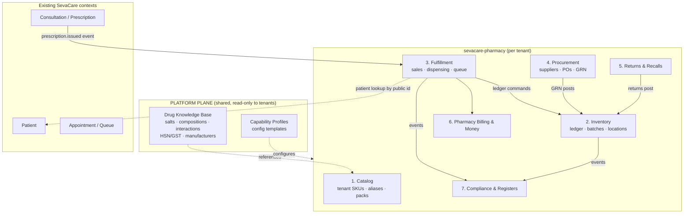

# SevaCare Pharmacy — Medication Management Operating System
## Architectural Blueprint v1.0 (for review — no code yet)

> **Status:** Draft for founder review · 2026-07-08
> **Scope:** Product vision → domain model → workflows → events → UX → configuration → backend architecture → AI → roadmap.
> **Stance:** Opinionated. Every major decision states *why it beats conventional Hospital ERP*. Open questions for you are collected in §20.

---

## Table of Contents

1. [Where SevaCare Stands Today — an honest audit](#1-where-sevacare-stands-today)
2. [Product Vision](#2-product-vision)
3. [Design Principles — the Eight Laws](#3-design-principles)
4. [Bounded Contexts & Domain Model](#4-bounded-contexts--domain-model)
5. [Entity Relationships](#5-entity-relationships)
6. [The Stock Ledger — the core architectural bet](#6-the-stock-ledger)
7. [Workflow Decisions](#7-workflow-decisions)
8. [State Machines](#8-state-machines)
9. [Event Architecture](#9-event-architecture)
10. [Configuration Model — the Capability Engine](#10-configuration-model)
11. [UI/UX Concepts — role workspaces](#11-uiux-concepts)
12. [Dashboards — action-oriented, not data-oriented](#12-dashboards)
13. [Backend Architecture](#13-backend-architecture)
14. [Regulatory & Compliance (India-first)](#14-regulatory--compliance)
15. [AI Strategy — SevaCare 2030](#15-ai-strategy)
16. [Industry Pain Points & Competitive Landscape](#16-industry-pain-points--competitive-landscape)
17. [Innovations that don't exist in current HMS products](#17-innovations)
18. [Risks & Tradeoffs](#18-risks--tradeoffs)
19. [Roadmap](#19-roadmap)
20. [Open Questions for Review](#20-open-questions-for-review)

---

## 1. Where SevaCare Stands Today

Before designing, I audited the actual codebase (not mentally — literally). What exists is a solid foundation with five structural gaps that pharmacy will expose. **We fix these as part of the pharmacy build, not after.**

### What exists and is good

| Asset | Why it matters for pharmacy |
|---|---|
| Schema-per-tenant Postgres (`TenantContext` + `search_path`) | Strong isolation; pharmacy data is financially and legally sensitive — this is the right model |
| Modular monolith (`sevacare-{admin,doctor,patient,tenant,shared}`) | Module-per-context maps cleanly to DDD bounded contexts; pharmacy becomes `sevacare-pharmacy` |
| Unified token queue (per-doctor/date/session atomic counters) | The *mental model* — one queue, many entry channels — is exactly what pharmacy fulfillment needs; we reuse the pattern, not the code |
| Public-ID string references across modules (no FK coupling across contexts) | Already the right DDD instinct: contexts reference by identity, not joins |
| Live queue board, QR walk-in, chatbot booking | Proof the "adapt to the hospital" philosophy works; pharmacy extends the same channels |

### Five structural gaps pharmacy will expose (challenge accepted)

**Gap 1 — Prescriptions are free text.** `PrescriptionMedicine` stores `medicineName`, `strength`, `frequency`, `duration` as raw strings. No quantity, no coded drug, no link to any catalog. A pharmacy cannot dispense against this without a *resolution layer*. Conventional ERPs "solve" this by forcing doctors to pick from a dropdown — doctors hate it and revert to paper. **Our answer (§7.1): free text stays legal forever; a resolution engine maps text → SKU at dispense time, and learns.**

**Gap 2 — Tenant DDL lives in Java strings.** `TenantSchemaMaintenanceService` creates tables via inline SQL; we have already been bitten by tenant schema drift (older tenants missing newer columns). Pharmacy adds ~20 tables and will change weekly during buildout. **Prerequisite: versioned per-tenant migrations (Flyway iterated across schemas) before pharmacy tables land.** This is a one-time infrastructure investment that de-risks everything after.

**Gap 3 — No platform data plane.** Everything lives in tenant schemas. But a drug knowledge base (compositions, salts, interactions, HSN/GST rates) is *shared world knowledge* — duplicating it per tenant is wrong (storage, correctness, update propagation). **We introduce a `platform` schema: read-only-to-tenants reference data + config profile templates.** This is the first deliberate crack in schema-per-tenant purity, and it's the correct one.

**Gap 4 — No event infrastructure.** All module interaction today is synchronous service calls; UI freshness is 20s polling. Pharmacy is the first module where *things happen because other things happened* (stock falls → reorder suggestion; consult ends → fulfillment queued; GRN posts → payables accrue). **We introduce a transactional outbox + in-process event bus now (§9); an external broker only when scale demands it.** Event-driven ≠ Kafka on day one.

**Gap 5 — Audit is incidental.** `createdAt/updatedAt` timestamps are not an audit trail. Pharmacy handles money, controlled substances, and drug inspectors. **The stock ledger (§6) makes audit a *structural property* of inventory rather than a bolted-on log**, and money/config mutations get first-class audit events.

### One assumption I challenge in the brief itself

The brief asks for "microservices boundaries." **I recommend against microservices at this stage — deliberately.** SevaCare runs as one Spring Boot deployable on Cloud Run with one Cloud SQL instance and (currently) one production tenant. Splitting into network-separated services now would buy: distributed transactions, operational overhead, latency, and a debugging nightmare — and deliver nothing a modular monolith doesn't. What we *do* take from microservices thinking: **hard module boundaries, context-owned tables, communication via events and public IDs only — so that any context can be extracted into a service later without redesign.** The boundaries are microservice-shaped; the deployment is monolithic. This is the difference between architecture and fashion. (Extraction triggers defined in §13.7.)

---

## 2. Product Vision

### The one-sentence vision

> **Every medicine movement in India — from distributor truck to patient's hand — flows through a system that adapts to how the pharmacy actually works, never blocks a sale, and turns compliance and analytics into byproducts of normal work.**

### What pharmacy software actually is

The brief says it well: not an inventory module, not a billing module, not a medicine database. Here is the sharper formulation that drives every design decision below:

**A pharmacy is a real-time ledger of trust.** The pharmacist trusts the doctor's intent (often scrawled), the patient trusts the pharmacist's dispensing, the owner trusts the stock numbers, the drug inspector trusts the registers, the distributor trusts the return claims. Every existing product breaks at least one of these trust links — usually by forcing the human to serve the software. SevaCare's pharmacy inverts this: **the software observes real work and derives the records, instead of demanding records before permitting work.**

### Why pharmacy decides SevaCare's fate

- **Frequency:** A clinic books tens of appointments a day; its pharmacy rings hundreds of transactions. Pharmacy is the highest-frequency surface in the product — daily-habit software wins.
- **Money:** Pharmacy is 30–40% of a small hospital's revenue and often *the* profit center. Software that provably protects margin (expiry loss, dead stock, purchase leakage) justifies its own subscription.
- **Wedge:** India has ~900k retail pharmacies and most run Marg/Excel/paper. A standalone-capable pharmacy module is a Trojan horse: the medical store adopts SevaCare Pharmacy alone, then grows into the full Healthcare OS when the attached clinic digitizes. **Design constraint: the pharmacy must be fully valuable with zero other SevaCare modules active.**

### Who we serve (in priority order)

1. **The pharmacist at the counter** — speed is oxygen; every extra click at billing is a queue growing.
2. **The owner** — margin, expiry loss, theft, payables; usually reviews on a phone at night.
3. **The store manager / senior pharmacist** — purchasing, returns, stock health.
4. **The doctor** — wants prescribing unchanged, plus quiet superpowers (stock-aware Rx).
5. **The patient** — wants their medicines ready, priced honestly, refills remembered.
6. **The drug inspector / auditor** — not a "user," but a stakeholder whose 10-minute visit can close a shop. We design their export button on day one.

---

## 3. Design Principles

Eight laws. Every screen, table, and API in this blueprint traces back to one of these. When a future decision is ambiguous, these break the tie.

**Law 1 — Never block the sale.** No validation, no stock shortfall, no missing prescription, no unsynced server may ever prevent a pharmacist from handing medicine to a patient and taking money. The system records the exception and queues the reconciliation. *Conventional ERPs enforce upfront and get bypassed with paper — then the data is worse than nothing.*

**Law 2 — Stock is a ledger, not a number.** Every quantity anywhere is derived from an append-only event ledger. There is no `UPDATE stock SET qty = ?` anywhere in the system, ever. This single decision gives us audit, offline merge, time-travel, and "why is my stock wrong?" explainability for free (§6).

**Law 3 — Capture now, structure later.** Free text is always accepted; structure is earned progressively via resolution engines and learning aliases. Data quality improves through use, not through mandatory fields.

**Law 4 — Every policy is a knob: OFF / SUGGEST / ENFORCE.** FEFO, Rx-required, batch capture, negative stock, price edits, credit limits — every behavioral rule in the product is one three-state policy. A medical store runs mostly OFF/SUGGEST; a corporate hospital runs ENFORCE. Same code, no forks. This *is* the "tell us how your hospital works" philosophy made mechanical (§10).

**Law 5 — Dashboards are to-do lists.** No screen exists to display data; every screen exists to complete an action. A "near-expiry report" is a failure; a "near-expiry queue with a *Create Return* button and the supplier's return-window deadline" is the product.

**Law 6 — Compliance is a byproduct.** The Schedule H1 register, GST returns data, narcotics register, expiry disposal records — all derived from operational events, never entered separately. If a record requires a second act of data entry, we designed it wrong.

**Law 7 — The counter works offline.** Billing survives an internet outage (this is India; power and fiber both flicker). The ledger architecture makes offline a sync problem, not a conflict problem (§13.5).

**Law 8 — Boundaries are microservice-shaped; deployment is boring.** Contexts own their tables, speak in events and public IDs, and could be extracted — but run in one process until scale, not fashion, demands otherwise.

---

## 4. Bounded Contexts & Domain Model

### 4.1 Context map

Seven bounded contexts inside the new `sevacare-pharmacy` module, plus two shared planes. Contexts communicate **only** via domain events (async) or public-ID lookups through published interfaces (sync, read-only).



### 4.2 The seven contexts, their jobs, and their non-jobs

**1. Catalog** — *"What can this pharmacy sell?"*
Owns the tenant's sellable SKUs: brand name, link to platform drug master (optional!), pack hierarchy (box→strip→tablet), rack location, tax class, schedule class, aliases. **Non-job:** stock quantities (Inventory's), prices paid (Procurement's). Key insight: **the tenant catalog is sovereign** — a pharmacy can sell an SKU the platform drug master has never heard of (surgical items, ayurvedic, local brands). Platform linkage *enriches* (interactions, substitution); it never *gates*.

**2. Inventory** — *"Where is every unit, and how did it get there?"*
Owns the stock ledger, batch records, stock locations (counter, store room, cold storage, quarantine, in-transit, ward sub-stocks), balances (derived), reservations, adjustments, cycle counts. The only context allowed to append ledger entries; all others send it commands. **Non-job:** deciding *whether* a movement is allowed — that's the caller's policy check; Inventory records faithfully (Law 1).

**3. Fulfillment** — *"Get the right medicine into the right hands, fast."*
Owns the unified fulfillment queue (Rx-linked orders, walk-in sales, ward indents, future home delivery), dispense orders, the free-text→SKU resolution workflow, substitutions, partial fills, refills. This is the pharmacist's home context. **Non-job:** money (Billing's), stock truth (Inventory's).

**4. Procurement** — *"Never run out; never overpay; never type an invoice."*
Owns suppliers, purchase orders (including AI-suggested drafts), goods receipts (GRN) with OCR-first capture, scheme/free-quantity handling, rate contracts, supplier payables signals. **Non-job:** full accounting (integrates with future Billing/Accounts context or Tally export).

**5. Returns & Recalls** — *"Money back from every failure mode."*
Customer returns (with restock/quarantine decision), supplier expiry returns (the Indian "breakage & expiry" claim cycle — tracked per supplier return-window), damage write-offs, manufacturer recalls (batch-level trace and pull). Elevated to its own context because in Indian pharmacy, **returns are a profit line, not an exception path** — 2–5% of revenue leaks here in badly run stores.

**6. Pharmacy Billing & Money** — *"Every rupee at the counter, correctly taxed."*
Invoices, payments (cash/UPI/card/credit), GST computation per line (batch-specific MRP and tax), credit ledgers for regulars ("khata"), day-close/cash-tally, invoice numbering (including offline number blocks). Kept separate from Fulfillment so hospital deployments can route to central patient billing (IPD encounter) while standalone stores bill at counter — same Fulfillment, different Billing policy.

**7. Compliance & Registers** — *"The inspector leaves in ten minutes, satisfied."*
Materializes Schedule H/H1/X registers, narcotics balance registers, expiry disposal records, temperature logs (cold chain, future IoT) from events. Pure read-model context: it owns no workflow, only projections and exports. Its existence as a *separate context* is the architectural guarantee of Law 6.

### 4.3 Aggregate roots (the consistency boundaries)

| Aggregate | Context | Invariant it protects | Concurrency model |
|---|---|---|---|
| `MedicineSku` (+ aliases, packs) | Catalog | pack hierarchy sums correctly; one active tax class | optimistic version |
| `StockLedgerEntry` | Inventory | immutable once written | append-only, no updates ever |
| `BatchBalance` (sku×batch×location) | Inventory | balance = Σ ledger; version increments per append | optimistic + conditional decrement (§13.4) |
| `Reservation` | Inventory | reserved ≤ balance when policy=ENFORCE; TTL expiry | row lock on create/consume |
| `DispenseOrder` (+ lines) | Fulfillment | line states consistent with order state | optimistic version |
| `PrescriptionFulfillment` | Fulfillment | one active fulfillment per prescription | unique constraint |
| `Sale` (+ lines, payments) | Billing | Σ payments ≤ total; immutable after day-close | optimistic version |
| `PurchaseOrder` / `GoodsReceipt` | Procurement | GRN lines trace to ledger entries 1:1 | optimistic version |
| `ReturnClaim` | Returns | credit ≤ returned value | optimistic version |

**Deliberate absence:** there is no `Stock` aggregate with a mutable quantity. That non-entity is the most important entity decision in this document.

---

## 5. Entity Relationships

### 5.1 Platform plane (new `platform` schema, shared across tenants)

```
drug_master ──< drug_composition >── salt
    │                                   │
    │ (brand, manufacturer,             │ salt_interaction (salt × salt, severity, note)
    │  form, schedule_class,            │ salt_allergy_class
    │  hsn_code, gst_rate)              │
    │
manufacturer          hsn_gst_rate (rate history, effective dates)
capability_profile ──< profile_module ──< profile_policy_default
```

- `drug_master` is seeded (~300k Indian brand-packs from licensed/curated data — see Risk R1) and centrally curated; tenants never write it.
- `salt` (INN/composition) is the substitution and interaction backbone: brands map to salts; equivalence and interaction checks operate at salt level, never brand level. *This is what most Indian pharmacy software gets wrong — they match brand strings.*

### 5.2 Tenant plane (per-tenant schema additions, ~20 tables)

```
CATALOG
  medicine_sku ──?── drug_master(platform, nullable link)
      ├──< sku_alias        (learned free-text names, misspellings, doctor shorthand)
      ├──< sku_pack         (box=10 strips, strip=10 tabs, tab — sellable flags per level)
      └── rack_location, schedule_class(copied+overridable), tax_class

INVENTORY
  stock_location            (COUNTER, STORE, COLD, QUARANTINE, TRANSIT, WARD:<id>…)
  batch                     (sku, batch_no, expiry, mrp, ptr/purchase_price, supplier_ref)
  stock_ledger              (APPEND-ONLY: sku, batch, location, qty_delta_base_units,
                             reason, ref_type+ref_id, actor, at, device_seq, correction_of?)
  batch_balance             (sku × batch × location → qty, version)   [derived cache]
  reservation               (sku, batch?, qty, ref, expires_at, state)
  cycle_count, cycle_count_line, adjustment_reason

FULFILLMENT
  fulfillment_queue_entry   (channel: RX|WALKIN|WARD|DELIVERY, priority, token_no)
  dispense_order ──< dispense_line
                       (rx_line_ref?, requested_text?, resolved_sku?, substituted_from?,
                        qty_requested, qty_dispensed, batch_allocations[])
  rx_resolution_log         (free_text → sku, confidence, accepted_by — trains aliases)

PROCUREMENT
  supplier                  (+ return_window_days, payment_terms, scheme_notes)
  purchase_order ──< po_line
  goods_receipt ──< grn_line   (batch creation source; scheme_free_qty; invoice_scan_url)
  supplier_price_history    (sku × supplier × date → ptr, scheme)

RETURNS
  customer_return ──< customer_return_line   (restock|quarantine decision per line)
  supplier_return_claim ──< claim_line       (state-tracked to credit note)

BILLING
  sale ──< sale_line (batch-level: mrp, price, gst%, discount) ──< payment
  credit_account            (patient/party khata, limit, balance)
  invoice_series            (per location/device number blocks for offline)
  day_close                 (cash tally, variance, locked_at)

SHARED
  outbox_event              (transactional outbox, §9)
  pharmacy_config           (resolved policy values, versioned)
  audit_event               (money/config/override mutations)
```

### 5.3 Relationship rules that differ from conventional ERP

1. **`sale_line` → `batch` is mandatory only at ENFORCE.** At SUGGEST/OFF, a sale line may carry `sku + qty` with batch allocation deferred — a background allocator assigns FEFO batches after the fact, and the reconciliation queue surfaces any that can't allocate. *Conventional ERP makes the pharmacist pick a batch per line at billing — the #1 speed killer at Indian counters.*
2. **`dispense_line.requested_text` survives forever** even after resolution to an SKU. The original doctor/patient words are evidence; the resolution is interpretation. Audit demands both.
3. **All quantities in the ledger are in base units** (tablets, ml), with pack context stored for display. Loose-strip sales (4 tabs from a strip of 10) — the single most common Indian pharmacy operation — become trivial rather than a fractional-stock hack.
4. **Cross-context references are public IDs, never FKs** (matches existing SevaCare convention). `dispense_line.rx_line_ref` is a string reference to the Prescription context; if the prescription module is absent (standalone store), the column is simply always null. Modules unplug cleanly.

---

## 6. The Stock Ledger

The single most consequential decision in this blueprint. Worth its own section because five other sections depend on it.

### 6.1 The model

Every stock movement is one immutable row:

```
stock_ledger(id, tenant, sku, batch, location, qty_delta,  -- +ve in, -ve out
             reason,      -- GRN | SALE | RETURN_IN | RETURN_OUT | TRANSFER_OUT |
                          -- TRANSFER_IN | ADJUST | CYCLE_COUNT | WARD_ISSUE |
                          -- DAMAGE | EXPIRY_QUARANTINE | DISPOSAL | OPENING
             ref_type, ref_id,       -- the business document that caused it
             actor, at, device_seq,  -- who, when, offline ordering
             correction_of)          -- reversal chain, never edit-in-place
```

`batch_balance` is a cache maintained in the same transaction — never the source of truth. Rebuildable from the ledger at any time (`REPLAY` job).

### 6.2 What this buys us (and what mutable-quantity ERPs can never offer)

| Capability | How the ledger provides it |
|---|---|
| **"Why is my stock wrong?"** | Stock Forensics screen: show every movement of SKU X between two dates, with document links. In Marg/Excel land this question costs an evening of arguing; here it's one query. This alone sells the product to owners. |
| **Time-travel** | Stock as of any past date = Σ ledger to that date. Auditors and GST officers routinely ask for this; conventional systems can't answer. |
| **Offline merge** | Offline devices append events with `device_seq`; sync is a set-union, not a conflict resolution. Two counters selling the same SKU offline never corrupt each other — worst case the *balance* goes negative, which is already a first-class state (Law 1). |
| **Negative stock as information** | A negative balance isn't corruption; it's the ledger telling you a GRN wasn't entered or a count is stale. The reconciliation queue turns it into a task. |
| **Free audit** | The ledger *is* the audit trail. No separate audit log for stock, no drift between them. |
| **Corrections with integrity** | Mistakes are reversed by compensating entries (`correction_of`), preserving what-was-believed-when. Critical for controlled-drug registers where overwriting history is illegal. |

### 6.3 The cost, honestly

- More rows: a busy pharmacy writes ~2–5k ledger rows/day → ~1.5M/year/tenant. Trivial for Postgres with monthly partitioning; balances answer all hot-path reads.
- Balance cache must be transactionally consistent with appends — one well-tested code path (§13.4), owned solely by the Inventory context.
- Developers must be *prevented* from writing quantity updates: enforced by making `batch_balance` writable only through the ledger-append service, plus a DB trigger raising on direct UPDATE as a tripwire.

The tradeoff is a bargain. **This is the moat: every capability in the left column above is a demo moment competitors structurally cannot copy without rewriting their inventory core.**

---

## 7. Workflow Decisions

Each workflow below states: the conventional-ERP way, why it fails in real Indian healthcare, and the SevaCare decision. Formal states are in §8.

### 7.1 Prescription → Pharmacy (the handoff that defines the product)

**Conventional:** Doctor must prescribe from the pharmacy's item master; pharmacy sees a structured order; anything else is "not in system." **Reality:** doctors prescribe brands the pharmacy doesn't stock, scribble on paper, use shorthand ("Tab PCM 650 1-0-1 x 5/7"). Forced dropdowns slow consults; doctors defect to paper; the integration dies in week two.

**SevaCare decision — the Resolution Engine:**
1. Consultation ends → `prescription.issued` event → a `PrescriptionFulfillment` appears in the pharmacy queue *automatically* (patient's existing token carries over — they're already in our queue system).
2. Each Rx line arrives as it was written (free text or structured — both legal).
3. The resolution engine proposes: exact SKU match → learned tenant alias → platform drug-master fuzzy match → **salt-level in-stock alternatives** (ranked by expiry-first, then margin). Pharmacist confirms with one keystroke; the confirmation trains `sku_alias` so the same scrawl auto-resolves next time.
4. If the doctor *did* pick from catalog (we offer stock-aware autocomplete in the consult screen — a quiet upgrade, never mandatory), resolution is skipped entirely.
5. Unresolvable lines don't block the rest of the order (partial dispensing is normal, §7.5).

*Why better:* the doctor's workflow is untouched on day one, yet the system converges toward structured data through use. Tenant-specific vocabulary (every hospital has its own shorthand) becomes an asset the tenant accumulates — and a switching cost in our favor.

### 7.2 Walk-in sale (the 20-second contract)

The highest-frequency flow in the entire product. Target: **scan-or-type → confirm → paid, in ≤20 seconds, zero mouse.**

- One screen, one text box: scan barcode / type 3 letters (search spans brand, salt, alias, rack code) / paste nothing. Enter adds the line at FEFO-suggested batch; qty defaults to 1 strip; `*4` suffix means 4 units; loose units first-class.
- Batch selection is **invisible by default** (FEFO auto-allocation); one keystroke opens batch override, which is logged, never questioned (SUGGEST mode).
- Schedule H/H1 lines show a passive amber strip: "Rx required — attach or skip." At SUGGEST, skipping needs one keystroke and is logged (feeding the H1 register with "Rx not produced" flag); at ENFORCE (hospital policy), a doctor/Rx reference is mandatory. Same screen, different knob.
- Payment: UPI QR displayed on customer-facing side / cash with change calculator / credit to khata. Bill prints/WhatsApps.
- Patient identity is **optional** (Law 1) — but one phone-number field, auto-suggesting repeat customers, quietly builds the refill/CRM base.

### 7.3 Purchasing & GRN (kill the typing)

**Conventional:** Staff types a 40-line supplier invoice into a GRN form — 30+ minutes, error-prone, so it's skipped, so stock is wrong forever. This is *the* root cause of inventory rot in Indian pharmacies.

**SevaCare decision — OCR-first GRN:**
1. Photograph / upload PDF / forward the WhatsApp invoice → OCR + LLM extraction to a **draft GRN** (supplier, lines, batches, expiry, PTR, scheme quantities like "10+1").
2. Human verifies a diff-style screen (green = confident, amber = check me), corrects, posts. Target: 40-line invoice in under 3 minutes.
3. Posting creates batches, appends ledger entries, records supplier price history (fuels margin analytics and PO suggestions), and matches against the originating PO (variance surfaced, not blocked).
4. Distributor integrations (Pharmarack/AWACS-style EDI) slot in later as a *bypass* of OCR — same draft-GRN doorway.

**PO lifecycle:** reorder engine (min/max to start; forecasting later, §15) emits **draft** POs grouped by preferred supplier — never auto-sends. Owner reviews on phone, edits, sends via WhatsApp/PDF/email. AI proposes; humans dispose (Law: §15.3).

### 7.4 Refills, returns, cancellations, replacements

- **Refill:** chronic patients (the most valuable segment) get refill records from any Rx marked ongoing or detected by cadence (same salt bought ~monthly). Reminder via WhatsApp → pre-picked order in queue → patient collects. Standalone stores get this too (phone-number CRM) — *no existing Indian pharmacy POS does this well.*
- **Customer return:** scan bill → pick lines → decision per line: restock (sellable) or quarantine (opened/cold-chain) → refund or credit-note to khata. Ledger reasons `RETURN_IN` / `EXPIRY_QUARANTINE` keep registers straight automatically.
- **Cancellation:** pre-payment cancels are free; post-payment cancels are compensating documents (credit note + reversing ledger entries). Nothing is ever deleted (day-close immutability, §8).
- **Replacement/substitution:** always salt-equivalence-checked, always recorded as `substituted_from`, patient-visible on the bill. At ENFORCE (hospital formulary mode) substitution requires doctor ack via a one-tap notification — reusing the existing SevaCare notification rails.

### 7.5 Partial dispensing & emergency dispensing

- **Partial:** every line carries `qty_requested / qty_dispensed`; a fulfillment can rest indefinitely in `PARTIALLY_FULFILLED` with the balance claimable later (walk back in with the bill/QR). Conventional systems force close-or-complete; reality is "we have 6 of 10 tablets, take these, come tomorrow."
- **Emergency (night counter, casualty):** a **fast-path mode**: dispense against patient name + "emergency" flag with *nothing else* — no Rx, no billing, no batch. Creates a high-priority reconciliation task for the morning shift. This flow existing *by design* is what stops hospitals from keeping a paper "night register" that never reconciles.

### 7.6 Ward / internal requests (hospital capability, off for stores)

- Ward raises an **indent** (nurse picks from formulary on the existing staff app) → pharmacy queue (same unified queue, `WARD` channel) → issue posts `WARD_ISSUE` ledger entries into the ward's sub-location → ward stock is visible, drawn down by administration recording (future eMAR) or periodic count.
- Discharge/unused returns flow back as ward→pharmacy transfers. Patient-level IPD billing hooks into the Billing context via the encounter reference (future IPD module) — the *pharmacy* side is already shaped for it.

### 7.7 Transfers & multi-location (chain capability)

Store-to-store and central-warehouse→branch transfers use a **TRANSIT virtual location**: dispatch posts `TRANSFER_OUT` (source→transit), receipt posts `TRANSFER_IN` (transit→dest) with received-quantity variance surfaced as an adjustment task. In-transit stock is therefore always visible and always sums — chains lose real money to "it left but never arrived" gaps that mutable-stock systems can't even represent.

### 7.8 Cycle counting & stock verification

Full-store stocktakes kill a business day, so nobody does them. SevaCare does **guided micro-counts**: the system picks one rack (or the 20 highest-variance-risk SKUs) per day; counting is a 10-minute scan-and-confirm on a phone; differences post as `CYCLE_COUNT` adjustments with reason capture. Risk-weighted scheduling (high-value, fast-moving, near-expiry, and recently-negative SKUs counted more often) means the whole store cycles monthly without ever closing.

### 7.9 Home delivery (future-proofed, not built)

The Fulfillment queue's `DELIVERY` channel, patient app ordering, and payment-link support are designed-in (channel enum, address on order, fulfillment states include `DISPATCHED`). Build later; no redesign needed.

---

## 8. State Machines

Formal states for the six aggregates whose lifecycles carry money or legal weight. Two global rules: **(a)** any transition may be performed "late" (backdated entry of something that already happened physically — Law 1/3), recorded with both `occurred_at` and `recorded_at`; **(b)** terminal states are reached only by compensating documents, never by edits.

### 8.1 DispenseOrder / Sale (fused at the counter; split in hospital mode)

```
DRAFT ──> PARKED (hold bill, serve next customer — first-class, hotkey)
DRAFT ──> RESERVED (stock soft-held, TTL 30min default)     [hospital/queue mode]
DRAFT|RESERVED ──> BILLED (invoice issued, payment recorded) ──> DISPENSED (handed over)
BILLED|DISPENSED ──> PARTIALLY_RETURNED ──> RETURNED (via CustomerReturn docs)
DRAFT|PARKED|RESERVED ──> CANCELLED (free)
BILLED ──> VOIDED (same-day, pre-day-close, manager PIN) — post-day-close only credit-note
```
Counter mode collapses DRAFT→BILLED→DISPENSED into one confirm. Hospital mode separates them (pharmacist prepares, cashier bills, counter hands over) — **same machine, different stops**, chosen by capability profile.

### 8.2 PrescriptionFulfillment (order level) + lines

```
Order:  QUEUED ──> IN_PREPARATION ──> READY ──> COLLECTED
        QUEUED|IN_PREPARATION ──> PARTIALLY_FULFILLED (balance claimable) ──> COLLECTED|LAPSED
        QUEUED ──> DECLINED (patient bought elsewhere — captured, feeds lost-sale analytics)
        any ──> LAPSED (auto, Rx validity expiry)
Line:   PENDING ──> RESOLVED ──> ALLOCATED ──> DISPENSED
        PENDING ──> UNRESOLVED (needs human) | OUT_OF_STOCK (feeds procurement signal)
        RESOLVED ──> SUBSTITUTED (salt-equivalent, recorded) ──> ALLOCATED ──> DISPENSED
        any ──> DECLINED (patient refusal — captured, per-line)
```
`OUT_OF_STOCK` and `DECLINED` are *data products*: they quantify lost sales and formulary gaps — numbers no Indian HMS surfaces today, and exactly what an owner needs to fix purchasing.

### 8.3 PurchaseOrder and GoodsReceipt

```
PO:   SUGGESTED (AI/min-max draft) ──> DRAFT (human touched) ──> SENT
      SENT ──> PARTIALLY_RECEIVED ──> RECEIVED ──> CLOSED     | any-pre-receipt ──> CANCELLED
GRN:  CAPTURED (OCR/manual draft) ──> VERIFIED (human diff-check) ──> POSTED (ledger + batches)
      POSTED ──> MATCHED (reconciled to PO + supplier invoice)  [three-way match at ENFORCE only]
```
A GRN may exist with **no PO** (reality: owner phones the distributor; truck arrives). Three-way matching is a corporate-hospital knob, not a default gate.

### 8.4 SupplierReturnClaim (the expiry-return money loop)

```
DRAFT (auto-assembled from near-expiry queue) ──> APPROVED ──> DISPATCHED (stock out of QUARANTINE)
DISPATCHED ──> CREDIT_RECEIVED (credit note value recorded, closes loop)
DISPATCHED ──> PARTIALLY_ACCEPTED | REJECTED (variance back to quarantine, loss recorded honestly)
```
Each supplier's `return_window_days` drives **deadline countdowns** on the near-expiry queue: "return to Sri Balaji Agencies by Jul 30 or lose ₹4,120." Conventional systems track expiry; none track the *claim* through to credit — where the actual money is.

### 8.5 Batch lifecycle (orthogonal status, derived + event-driven)

```
ACTIVE ──> NEAR_EXPIRY (threshold: knob, default 90d) ──> EXPIRED ──> DISPOSED
ACTIVE|NEAR_EXPIRY ──> QUARANTINED (damage/recall/return-staging) ──> back | RETURNED | DISPOSED
any ──> RECALLED (manufacturer recall: batch trace shows every sale, ward issue, patient contact)
```
Expiry transitions fire from a daily scheduler *and* are checked lazily at dispense (belt and braces — scheduler races already bit SevaCare once).

### 8.6 StockTransfer & WardIndent

```
Transfer: REQUESTED ──> APPROVED ──> DISPATCHED (out→TRANSIT) ──> RECEIVED (TRANSIT→dest, variance→task)
Indent:   RAISED ──> APPROVED (auto at OFF/SUGGEST) ──> ISSUED ──> ACKNOWLEDGED
          RAISED ──> REJECTED (with reason, notifies ward)
```

---

## 9. Event Architecture

### 9.1 Stance: event-driven semantics, boring transport

Contexts *behave* event-driven (publish facts, subscribe to facts, no synchronous cross-context writes), but transport starts as **transactional outbox + in-process dispatcher** in the existing monolith:

1. Business transaction writes aggregate + `outbox_event` row atomically (same tenant schema, same TX). No dual-write problem, no distributed transaction, ever.
2. A dispatcher (polling now; LISTEN/NOTIFY later) delivers to in-process subscribers; consumers are idempotent by `event_id`; failures retry with backoff; poison events park in a dead-letter table with an admin surface.
3. When/if contexts extract to services (§13.7), the dispatcher grows a Pub/Sub publisher — **producers and consumers don't change**. The outbox is the seam.

*Why better than conventional ERP:* ERPs do everything in one god-transaction (sale updates stock, billing, registers, analytics synchronously) — slow counters and lockstep coupling. *Why better than day-one Kafka:* zero ops burden, exactly-once by construction within the monolith, and we keep Cloud Run's scale-to-zero economics.

### 9.2 Envelope & catalog

```json
{ "event_id": "uuid", "event_type": "pharmacy.sale.completed", "schema_version": 1,
  "tenant_id": "T-1013", "location_id": "LOC-MAIN", "aggregate_type": "Sale",
  "aggregate_id": "S-2026-004512", "sequence": 7, "actor": "USR-…",
  "occurred_at": "…", "recorded_at": "…", "payload": { } }
```

| Event | Producer | Key consumers |
|---|---|---|
| `prescription.issued` | Consultation (existing module — its first published event) | Fulfillment (enqueue), Compliance |
| `pharmacy.fulfillment.state_changed` | Fulfillment | Patient app ("medicines ready"), queue board |
| `pharmacy.sale.completed` | Billing | Inventory (allocate if deferred), Compliance (H1), Analytics, CRM/refill |
| `pharmacy.stock.ledger_appended` | Inventory | Balance projections, Compliance registers, Analytics |
| `pharmacy.stock.below_reorder` / `pharmacy.batch.near_expiry` | Inventory schedulers | Procurement (PO drafts), Returns (claim drafts), dashboards |
| `pharmacy.grn.posted` | Procurement | Inventory (batches+ledger), price history, payables signal |
| `pharmacy.return.credit_received` | Returns | Analytics (recovery rate), payables |
| `pharmacy.batch.recalled` | Inventory | Fulfillment (block+trace), Patient notify, Compliance |
| `pharmacy.config.changed` | Config | All contexts (policy cache invalidation), Audit |

### 9.3 Read models & projections

Compliance registers, dashboards, and analytics are **projections** rebuilt from events — never queried off hot operational tables. This is what keeps the 20-second sale contract safe from the owner running a year-long margin report at noon. Projections live in per-tenant read tables now; a columnar sidecar (BigQuery export) when chains need cross-store analytics.

---

## 10. Configuration Model

### 10.1 The Capability Engine — three layers, resolved top-down

**Layer 1 — Capability Profiles (choose one at onboarding; sets everything):**

| Profile | Modules on | Character |
|---|---|---|
| `MEDICAL_STORE` | Catalog, Inventory, Fulfillment(walk-in), Procurement, Returns, Billing, Compliance | POS-first; no Rx queue, no wards; SUGGEST-most policies |
| `CLINIC_DISPENSARY` | + Rx queue, doctor integration | Consult→dispense handoff is the hero flow |
| `HOSPITAL_PHARMACY` | + Wards/indents, multi-location(sub-stores), formulary | ENFORCE-leaning defaults; role separation |
| `PHARMACY_CHAIN` | + Transfers, central purchasing, cross-store views | HQ/branch role split; consolidated analytics |
| `CORPORATE_ENTERPRISE` | + three-way match, approval chains, API access | Governance features on |

Onboarding stays a **single question** ("what are you?"), consistent with SevaCare's existing hospital onboarding. Profiles are templates, not cages — everything below is adjustable.

**Layer 2 — Feature modules (on/off):** wards, cold-chain, controlled-drugs, delivery, khata-credit, transfers… A medical store *never sees* ward UI — not grayed out, **absent** (navigation, search, and docs all respect module flags).

**Layer 3 — Policy knobs (OFF / SUGGEST / ENFORCE)** — the heart of "adapts to you":

| Policy (sample of ~25) | OFF | SUGGEST (most defaults) | ENFORCE |
|---|---|---|---|
| `rx_required_schedule_h1` | silent | amber strip, one-key skip, logged | hard require Rx/doctor ref |
| `fefo_allocation` | manual batch | auto-FEFO, one-key override, logged | no earlier-expiry bypass w/o manager PIN |
| `negative_stock` | allowed silently | allowed + reconciliation task | blocked (corporate only) |
| `batch_on_sale_line` | qty only, allocate later | auto-allocated, visible | explicit batch confirm |
| `price_edit_at_billing` | free | allowed, margin-floor warning | manager PIN below floor |
| `po_approval` | direct send | draft→send by anyone | approval chain |
| `substitution_needs_doctor_ack` | no | notify doctor, proceed | wait for ack |

**Resolution:** platform default → profile → tenant → location → role, most-specific wins; resolved config is cached per tenant and versioned — every change is an `audit_event` with actor and before/after (an inspector-grade answer to "who allowed negative stock?").

### 10.2 Why this beats conventional ERP configuration

ERPs configure with hundreds of independent booleans discovered over months of consulting engagements. The knob model gives: **(a)** one mental model for every rule; **(b)** a migration path — hospitals start SUGGEST and ratchet to ENFORCE as staff adapt, which is exactly how real digitization happens; **(c)** honest data even when rules are loose, because SUGGEST logs every skip (paper workarounds log nothing); **(d)** demos that answer "we don't work that way" with a knob flip instead of "we'll customize it" (the ERP lie).

---

## 11. UI/UX Concepts

### 11.1 The interaction doctrine

- **One question per screen:** every workspace answers a single user intent ("serve this patient," "fix stock health," "receive this truck"). Data with no action attached is demoted or deleted.
- **Keyboard/scan-first at the counter, thumb-first everywhere else.** The pharmacist gets a desktop/tablet workspace where hands never leave keyboard+scanner; owner and manager surfaces are phone-first (they run the store from a scooter, realistically).
- **Speed budget as a tested contract:** walk-in sale ≤20s, Rx dispense ≤45s, 40-line GRN ≤3min, day-close ≤2min. These go into Playwright perf checks like the existing fixed-frame-tabs checks — UX regressions fail CI.
- **Global command bar (Ctrl+K / long-press):** "amox" → sell/stock/history/order actions on Amoxicillin; "grn" → new receipt. One habit to learn; every feature reachable.
- **Reuse SevaCare's design DNA:** the pharmacy queue board *is* the live token board pattern; patient "medicines ready" *is* the token ticket pattern; AppShell/fixed-frame-tabs conventions carry over (with the known `scrollable:false` and IndexedStack patterns).

### 11.2 Role workspaces

**Pharmacist — "the Counter":** three-pane workspace. Left: unified queue (Rx/walk-in/ward/delivery, color-chipped by channel, priority-sorted — emergency floats). Center: active order canvas (scan/type→lines; resolution cards for free-text Rx lines showing proposed SKU + in-stock salt alternatives + one-key accept). Right: context rail (patient's medication history, allergy/interaction flags at SUGGEST, khata balance, refill due). Park/resume with hotkeys; the queue *is* the homepage — a pharmacist opens the app and is already working.

**Store Manager — "Stock Health":** not a report page — five action queues with buttons: *Near-expiry* (value at risk + per-supplier return deadline + "Draft claim"), *Low/out* ("PO draft ready — review"), *Reconciliation* (negative stocks, unallocated sales, GRN variances), *Dead stock* (no movement 90d + "discount/return/transfer" actions), *Today's count* (guided 10-min cycle count). Each queue shows count + ₹ impact; empty queues collapse. **The manager's job is literally "empty the queues" — the software states the job.**

**Owner — "Money" (phone-first):** today at a glance — sales, true margin (batch-cost-aware, scheme-adjusted), cash vs UPI vs credit split, day-close variance; payables due this week; expiry ₹ at risk; GST liability accruing. One daily WhatsApp digest (owners live on WhatsApp; meet them there). Drill-down exists, but the digest is the product.

**Doctor:** consult screen unchanged; medicine autocomplete quietly gains in-stock/formulary hints (subtle dot, never a block). Substitution-ack notifications are one-tap. *The doctor should barely notice pharmacy exists — that's the design goal.*

**Receptionist/Staff:** ward indents from the existing staff app; "pharmacy status" chip on patient cards (queued/ready/collected).

**Platform Admin (SevaCare ops):** drug-master curation console, alias-learning review across tenants (privacy-scoped), profile template editing, per-tenant adoption scores (§17.9).

### 11.3 Anti-patterns banned by this doctrine

Modal-on-modal; mandatory fields that don't change downstream behavior; "Are you sure?" on reversible actions (undo instead — the ledger makes undo real); pagination in operational queues (queues must end, not paginate); settings pages that mirror the database schema; empty-state screens that don't offer the first action.

---

## 12. Dashboards

**Principle: a dashboard is a to-do list with money attached (Law 5).** Three tiers:

1. **Operational (pharmacist/manager, live):** the queues of §11.2 — every tile is `count × ₹ impact × primary action`. Freshness via the existing polling mixin now, SSE later.
2. **Managerial (owner, daily):** yesterday closed vs 7-day trend; margin by category; top movers/decliners; lost-sale log (out-of-stock declines from §8.2 — *"you lost ₹3,400 yesterday to 12 out-of-stocks; 8 are in the pending PO"*); supplier scorecards (fill rate, price drift vs market, return acceptance).
3. **Strategic (owner/chain, monthly):** dead capital trend, inventory turns, expiry loss %, purchase price variance, branch comparisons, formulary gap analysis (prescribed-but-not-stocked ranked by frequency — tells the owner exactly what to start stocking).

Charts follow the existing dataviz conventions already used in admin insights; every number is clickable through to the underlying documents (the ledger makes every aggregate explainable — no dead-end KPIs).

---

## 13. Backend Architecture

### 13.1 Module & deployment topology

New Maven module `sevacare-pharmacy` beside the existing four, internally packaged by bounded context (`catalog/`, `inventory/`, `fulfillment/`, `procurement/`, `returns/`, `billing/`, `compliance/`), each with its own `entity/repository/service/api` and a small `spi/` (the only package other contexts may import). ArchUnit tests enforce the boundaries — the monolith stays modular by CI, not by discipline. Deployment remains the single Cloud Run service; pharmacy endpoints under `/api/pharmacy/**` with the existing JWT/tenant filter chain.

### 13.2 Multi-tenant data (evolving, not replacing)

- **Tenant plane:** pharmacy tables join each tenant schema — isolation, backup, and "delete tenant = drop schema" semantics preserved.
- **Platform plane (new):** `platform` schema for drug master, salts, interactions, GST/HSN, profile templates. Read-only to tenant flows; written by ops console. Cached hard (immutable-ish, versioned refresh).
- **Prerequisite (Gap 2):** Flyway-per-tenant-schema migration runner replaces DDL-in-Java before pharmacy tables land; `TenantSchemaMaintenanceService` becomes "iterate schemas, run pending migrations." Existing tables get baseline migrations. This also permanently fixes the tenant-drift class of bugs.

### 13.3 Reservation & allocation

- **Counter sales:** no reservation — allocate at commit (sub-second window; conditional decrement below resolves races).
- **Rx/queue orders:** soft reservation at `IN_PREPARATION` (TTL 30min, sweeper releases; the existing scheduled-task-race lesson applies — sweeper is idempotent and lazy-checked at read).
- **Allocation:** FEFO across batches at the order's location, skipping quarantined/recalled; deferred-allocation mode (knob) lets the sale commit qty-only and a background allocator assign batches within seconds — keeping the 20-second contract even when batch data is messy.

### 13.4 Concurrency & correctness (the money paths)

- Ledger append + balance upsert in one TX: `UPDATE batch_balance SET qty = qty + :delta, version = version + 1 WHERE …` — at ENFORCE, `AND qty + :delta >= 0` with a friendly conflict path; at SUGGEST/OFF, unconditional (negative allowed, task emitted).
- Multi-line orders lock balances in canonical (sku,batch,location) order — no deadlocks.
- Hot single-row contention (one blockbuster SKU, many counters) is bounded by pharmacy physics: even 10 counters × 1 sale/20s is ~0.5 writes/s/SKU — Postgres shrugs. **No Redis, no queues for correctness; the database is the concurrency control.** (Advisory locks reserved as an escape hatch; not expected to be needed.)
- Invoice numbers: per-location sequential series (GST requirement) allocated in blocks to devices (§13.5) — never derived from row IDs.

### 13.5 Offline-first POS (Law 7)

- Flutter local store (SQLite/Drift) holds: catalog + alias cache, balance snapshot, open orders, and an **outbound event queue** (sale events with `device_seq`).
- Offline sales bill against the snapshot; invoice numbers come from a pre-allocated per-device block (e.g., `MAIN-B2-0001…0500`) so numbering stays legally sequential per series without coordination.
- Sync = upload event queue (idempotent by event id) + download ledger delta. **Because stock is a ledger, merge is set-union — no conflict resolution UI exists anywhere.** Worst case: balance dips negative → reconciliation task (already a first-class state).
- Scope discipline: **only the sale path works offline** (v1). GRN, transfers, config need the server. This keeps offline small enough to be reliable, which is the only kind of offline worth shipping.

### 13.6 Search, caching, audit, scale

- **Search:** Postgres `pg_trgm` + unaccent over SKU/alias/salt (per-tenant, ~10–30k SKUs) — sub-10ms without new infrastructure; the alias table makes search *learn*. External search engines only if chains demand cross-tenant catalogs.
- **Caching:** platform drug master (heavy, versioned), resolved config per tenant (invalidated by `pharmacy.config.changed`), balance snapshots for POS. No cache on operational truth.
- **Audit:** ledger covers stock; `audit_event` covers money/config/overrides (price edits, H1 skips, FEFO bypasses, void bills) — one queryable stream per tenant, inspector-exportable.
- **Scale path (in order, each step deferred until measured need):** Cloud Run horizontal scale (stateless already) → Cloud SQL read replica for projections/analytics → monthly partitioning of `stock_ledger`/`sale` → tenant sharding across databases (registry already maps tenant→datasource) at ~3–5k schemas → context extraction to services (§13.7). Nothing in the design blocks any step; nothing requires taking one early.

### 13.7 Extraction triggers (when the monolith actually splits)

Extract a context to its own service only when one of: **(a)** divergent scaling (e.g., OCR/AI workloads starving the API — extract `pharmacy-intelligence` first, it's stateless); **(b)** team ownership boundaries (>2 teams in one deployable); **(c)** a context needs a different runtime (search, ML). The outbox becomes the network seam; public IDs already prevent join coupling. *Written down now so future-us doesn't extract out of boredom.*

---

## 14. Regulatory & Compliance (India-first)

| Requirement | How SevaCare handles it |
|---|---|
| **Schedule H/H1** (Rx-required; H1 register — patient, doctor, drug, qty; 3-year retention) | Schedule class on SKU (from drug master, tenant-overridable); H1 register is a projection off sale events — always current, one-click PDF/print for inspectors; SUGGEST mode logs "Rx not produced" honestly rather than forcing fake entries |
| **Schedule X / narcotics** | Module flag: double-verification dispense (two-user confirm knob), running-balance register per batch, storage-location restriction; ledger immutability satisfies register-tampering rules by construction |
| **GST** | HSN + rate from platform (rate history with effective dates — rates change); per-line tax at batch MRP; GSTR-1/3B export views; credit/debit notes as first-class docs; offline number blocks keep series sequential |
| **DPCO price ceilings** | Ceiling price on drug master where applicable; billing warns (SUGGEST) or blocks (ENFORCE) above-ceiling sale — a real inspection trigger most software ignores |
| **Expiry law** (selling expired = criminal liability) | This one policy has **no OFF**: expired batches cannot allocate, period. The lone hard block in the product, and it protects the pharmacist personally |
| **ABDM/NDHM** | ABHA-linked patients (SevaCare already holds patient identity), e-Rx consumption and dispense-event push to ABDM network as a Phase-4 module; HFR facility registration fields on tenant onboarding |
| **Drug recalls** | Batch-level trace (§8.5): every sale/ward-issue of a recalled batch, with patient contact where known — an answer in minutes vs the industry's "check the purchase files" |

---

## 15. AI Strategy — SevaCare 2030

### 15.1 Where AI works from day one (assistive, human-confirmed)

1. **Invoice OCR→GRN** (§7.3) — the single highest-ROI AI feature in the product; it attacks the root cause of bad inventory data.
2. **Rx resolution** — free text/scrawl → SKU proposals with confidence; every acceptance is training signal into `sku_alias`; handwriting OCR for paper Rx photos extends the same pipeline.
3. **Demand forecasting → draft POs** — seasonality (monsoon antimalarials, flu spikes), local Rx patterns, supplier lead times; always lands as `SUGGESTED`, never auto-sends.
4. **Dead-stock & expiry advisor** — "transfer to Branch 2 (sells 40/mo), or return by Jul 30, or bundle-discount" — options with ₹ outcomes, human picks.
5. **Interaction/allergy screening** at SUGGEST — salt-level checks against the patient's SevaCare medication history (a cross-module advantage standalone pharmacy software cannot have).
6. **Natural-language analytics** — owner asks WhatsApp/app "इस महीने सबसे ज़्यादा margin किसमें था?" — answers grounded in the ledger, with the query shown.

### 15.2 Where AI must never act

Never block a dispense (advice only — Law 1). Never silently alter stock, prices, or documents (suggestions are drafts). Never auto-substitute or auto-dose (clinical judgment stays human; India's legal substitution regime demands it). Never auto-send money-moving documents (POs, credit notes, GST filings). Never train across tenants on identifiable data (aliases and forecasts are tenant-scoped; only platform drug-master curation aggregates, anonymized).

### 15.3 The doctrine

**AI proposes; humans dispose; the system remembers.** Every AI output enters an existing human state machine as a draft (`SUGGESTED` PO, `CAPTURED` GRN, resolution card) — AI never gets its own bypass lane. Acceptance/rejection is logged, so AI quality is *measured* (acceptance rate per feature per tenant) and features that don't earn trust are visibly failing rather than silently annoying. By 2030 the pharmacist's job shifts from typing to confirming — and the confirmation click is both the safety layer and the training data.

---

## 16. Industry Pain Points & Competitive Landscape

### 16.1 Pain, by persona (what we heard/observed; each maps to a design answer)

| Persona | Top frustrations today | SevaCare answer |
|---|---|---|
| Pharmacist | Batch-pick per line kills billing speed; software blocks sales on technicalities; GRN typing hell; Windows-XP UX; system down = shop down | 20s sale contract; Law 1; OCR GRN; §11 doctrine; offline POS |
| Owner | Stock numbers never match; expiry losses discovered too late; no idea of true margin (schemes distort); can't watch store remotely; staff theft invisible | Ledger + forensics; return-deadline queues; batch-cost margin; phone Money view + WhatsApp digest; day-close variance + audit stream |
| Doctor | Forced item-master dropdowns; no idea if prescribed drug is stocked; pharmacy calls interrupting consults | Free-text forever + quiet stock hints; substitution one-tap ack |
| Patient | Wait with no status; substituted silently; loses paper Rx; forgets refills | Token-style "ready" status; substitution on bill; Rx lives in SevaCare; refill reminders |
| Inspector/auditor | Registers handwritten, backfilled, inconsistent | Projections from events; immutable ledger; one-click export |

### 16.2 Competitive read (mental study — validate in field, R6)

- **Marg ERP (dominant Indian retail pharma):** genuinely fast keyboard billing (respect — we match it), but DOS-era UX, on-prem single-PC, no real multi-location, no clinical link, reports not actions. *We beat it on: cloud+phone, hospital integration, action queues, forensics — while refusing to be slower at the counter.*
- **GoFrugal / RetailGraph:** competent retail POS, pharmacy as a vertical skin; no clinical spine; per-store licensing pain for chains.
- **eVitalRx:** the credible cloud-native Indian pharmacy player; good POS + drug DB. Shallow hospital side (no wards/indents/consult loop), conventional mutable inventory, config by feature list not philosophy. *Our differentiation: the OS story — one system from consult to counter — plus ledger capabilities.*
- **Medeil, Halbe, etc.:** feature checklists over workflow depth; weak offline; aging UX.
- **HMS suites (HMIS/Insta/KareXpert…):** pharmacy is a billing afterthought inside a hospital-first product; unusable standalone; stores won't adopt. *Our standalone-first constraint is aimed exactly here.*
- **Epic Willow / Cerner (global reference):** deep clinical pharmacy (order verification, eMAR) — the ceiling to learn from — but hospital-only, US-priced, workflow-rigid. We adopt their *closed-loop* ambition at Indian price and flexibility.
- **1mg/PharmEasy (threat, not competitor software):** e-pharmacies own patient relationships and squeeze local stores. *SevaCare arms the local pharmacy with the same weapons — app ordering, refill CRM, delivery channel — while it keeps the trust relationship. "Shopify for local pharmacies, not Amazon against them." This framing matters for adoption marketing.*

### 16.3 The category claim

Every competitor is either **retail POS without a clinical spine** or **HMS with a pharmacy afterthought**. The category-defining position — *medication management OS that is excellent standalone and seamless when connected* — is genuinely unoccupied in India. That's the wedge (§2) and the reason pharmacy may determine SevaCare adoption overall.

---

## 17. Innovations (not found in current HMS/pharmacy products)

1. **Stock Forensics** — "why is this number wrong?" answered with a movement timeline + document links; time-travel stock for any date. (Ledger, §6)
2. **OFF/SUGGEST/ENFORCE policy fabric** — digitization as a ratchet, not a cliff; honest skip-logging in SUGGEST. (§10)
3. **Expiry-Return Autopilot** — per-supplier return-window deadlines with auto-drafted claims tracked through to credit notes; recovers real money. (§8.4)
4. **Learning Rx-resolution** — tenant-specific alias learning turns each hospital's scrawl into a growing asset and a switching cost. (§7.1)
5. **Unified fulfillment queue** — Rx, walk-in, ward, delivery as channels of one queue, extending SevaCare's proven token system to medicines; patients see "ready" like they see tokens. (§7.1/§11)
6. **Lost-sale ledger** — declined/out-of-stock lines quantified in ₹ and fed to purchasing; the invisible leak, made visible. (§8.2/§12)
7. **Compliance as projection** — H1/narcotics/GST registers materialize from events; the inspector export button. (§14)
8. **Guided micro-cycle-counts** — 10 minutes a day, risk-weighted, store never closes for stocktake. (§7.8)
9. **Adoption score** — per-tenant measure of digitization depth (batch capture rate, GRN coverage, reconciliation backlog…) shown to owners as a growth path and to SevaCare ops as a health/churn signal. The "progressive digitization ladder" made visible.
10. **True margin engine** — batch-cost, scheme-adjusted (10+1 free goods), expiry-loss-netted margin; most owners today literally do not know their real margin.
11. **WhatsApp-native surfaces** — owner digest, supplier POs, invoice-photo GRN intake, patient refill nudges — meeting Indian users where they already are.
12. **Salt-level substitution with stock awareness** — clinically correct equivalence (not brand-string matching) ranked by expiry and margin, patient-transparent on the bill.

---

## 18. Risks & Tradeoffs

| # | Risk | Severity | Mitigation |
|---|---|---|---|
| R1 | **Drug master data quality/licensing** — no free authoritative Indian drug DB; commercial data (AWACS/IQVIA-class) costs money; bad salt mappings poison substitution & interaction features | **High — the #1 product risk** | Seed from curated open sources + license evaluation; tenant catalog sovereign (platform link optional) so bad master data never blocks selling; ops curation console + confidence tiers; interaction checks ship only at SUGGEST until data earns trust |
| R2 | Offline sync complexity balloons | High | Scope fence: sale path only (§13.5); ledger merge model; per-device number blocks; ship online-first, offline in a fast-follow once POS stabilizes |
| R3 | Scope explosion (this document describes years of work) | High | Phasing with standalone value per phase (§19); capability profiles let us ship `MEDICAL_STORE` completely before wards exist |
| R4 | Migration friction — stores won't retype masters/stock from Marg/Excel | Medium-high | First-class importers (Marg export formats, Excel templates, opening-stock via `OPENING` ledger entries + photographed stock sheets through the OCR pipeline); this is an adoption feature, not a chore |
| R5 | Counter speed regression as features accrete | Medium | Speed budgets in CI (§11.1); every added keystroke needs a removed one |
| R6 | Mental competitive/domain analysis is wrong somewhere | Medium | Validate with 5–10 pharmacist/owner interviews + 2 pilot stores before Phase-1 code freeze; treat §16 as hypotheses |
| R7 | Regulatory drift (GST rates, schedules, DPCO, e-Rx mandates) | Medium | All regulatory data is *data* (platform plane, effective-dated), never code constants |
| R8 | Schema-per-tenant catalog bloat at scale (10k+ schemas × 20 tables) | Low now | Known ceiling; tenant sharding path defined (§13.6); not a Phase-1/2 concern |
| R9 | Ledger discipline erodes (someone writes a quantity UPDATE) | Low | Single append service + DB trigger tripwire + ArchUnit rules (§6.3, §13.1) |

**Tradeoffs accepted deliberately:** ledger storage/complexity over mutable simplicity (bought: audit, offline, forensics) · modular monolith over microservices (bought: velocity, ops sanity; cost: future extraction work, mitigated by seams) · SUGGEST-default over enforcement purity (bought: adoption + honest data; cost: messier data early — the reconciliation queues are the cleanup engine) · platform plane over pure tenant isolation (bought: shared knowledge; cost: one more schema to govern) · Postgres-for-everything over best-of-breed infra (bought: one system to operate; cost: revisit at chain scale).

---

## 19. Roadmap

**Phase 0 — Foundations (prerequisite, ~small):** Flyway-per-tenant migration runner (Gap 2) · `platform` schema + seed drug master slice · outbox + in-process event bus (Gap 4) · `sevacare-pharmacy` module skeleton with ArchUnit boundaries.

**Phase 1 — The Standalone Store (complete `MEDICAL_STORE` profile):** Catalog + aliases + pack hierarchy · ledger + balances + locations · counter sale (20s contract) + billing + GST + day-close · manual GRN + suppliers · basic returns · near-expiry/low-stock queues · owner Money view · Marg/Excel importers. **Exit test: a real medical store runs its whole day on SevaCare and the owner sees true margin.**

**Phase 2 — The Connected Pharmacy (`CLINIC_DISPENSARY` + hospital basics):** `prescription.issued` → unified queue · resolution engine + alias learning · patient "ready" status + refill reminders · OCR GRN · substitution flow · H1 register + inspector export · Stock Forensics · draft-PO reorder engine.

**Phase 3 — The Hospital & Chain:** wards/indents/sub-stores · transfers + TRANSIT · multi-location + chain analytics · cycle counting · supplier return claims end-to-end · offline POS · approval chains/ENFORCE hardening.

**Phase 4 — The Intelligent Network:** demand forecasting · dead-stock advisor · interaction screening · NL analytics · ABDM/e-Rx · delivery channel + patient ordering · distributor EDI · (evaluate) `pharmacy-intelligence` service extraction.

Each phase ships a sellable product to a real segment; no phase depends on a later one for its value.

---

## 20. Open Questions for Review

The decisions I want your input on before we cut Phase 0/1 scope:

1. **Wedge priority:** Is the standalone medical store truly the first target (Phase 1 as ordered), or do existing SevaCare hospital tenants (T-1013 et al.) come first — which would pull Phase 2's Rx-queue forward and push importers back?
2. **Drug master sourcing (R1):** budget appetite for licensed data vs building curated seed + ops console? This decision gates substitution/interaction feature timing.
3. **Billing boundary:** keep pharmacy billing self-contained (as designed) and integrate hospital-wide billing later — or is a unified billing module already on your near-term roadmap (changes Context 6's shape)?
4. **Offline priority:** fast-follow after Phase 1 (my recommendation) or Phase-1 blocker for your target geography's connectivity reality?
5. **Pilot access:** do we have 1–2 friendly pharmacies/hospital dispensaries for R6 validation interviews and Phase-1 pilots?
6. **Compliance depth at launch:** is Schedule X/narcotics support needed by any near-term prospect, or does it stay a Phase-3 module flag?

---

*End of blueprint v1.0 — SevaCare Pharmacy: Medication Management Operating System.*
